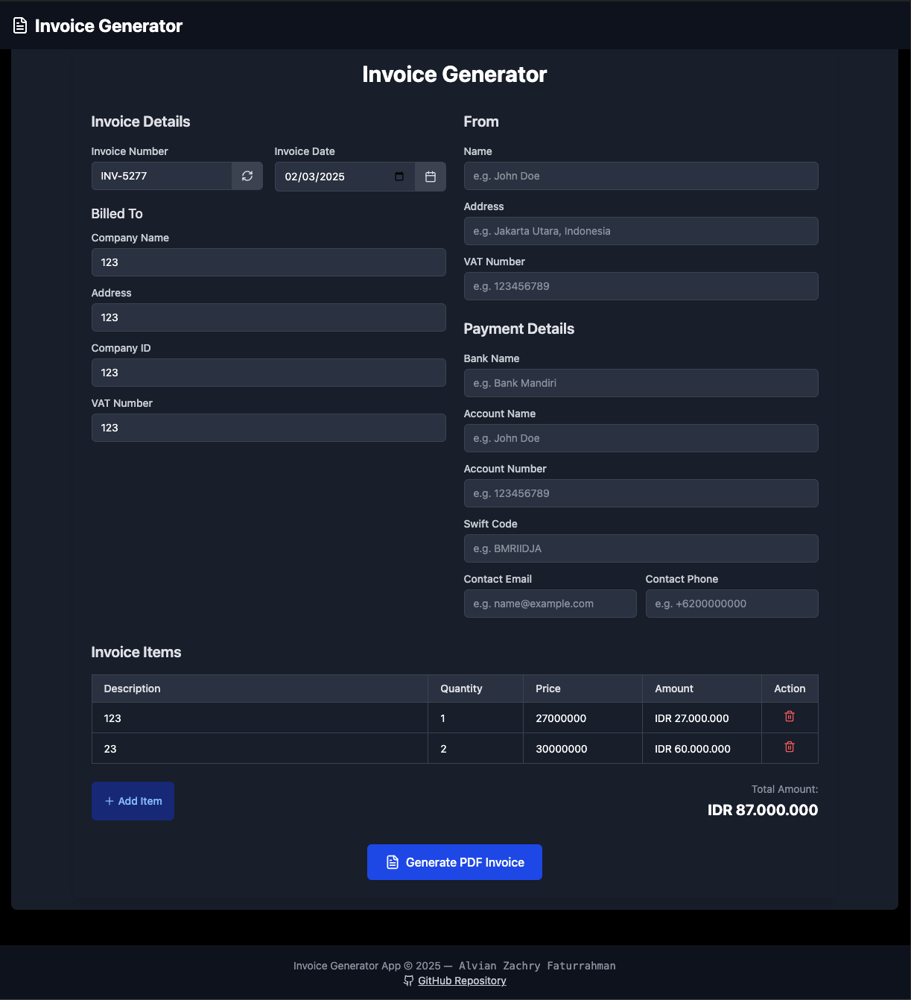
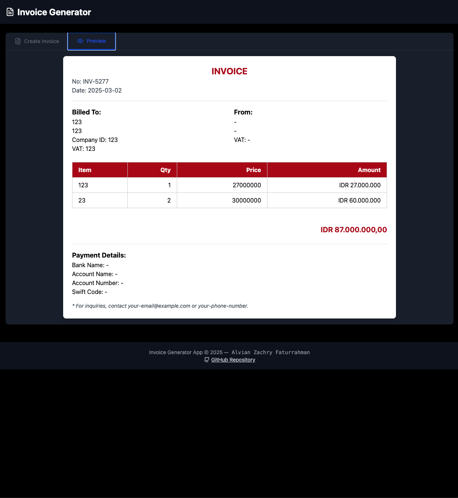

# 🧾 Invoice Generator for Contractors & Freelancers  

  

> Because doing invoices manually is so 2010.  

Are you tired of manually creating invoices like it's the medieval era? **This Invoice Generator** is here to save your precious freelancer time so you can focus on **procrastinating working on your real projects.**  

---

## 🎬 Preview  

Behold, the futuristic invoice generator in action:  

  

---

## 🚀 Features  

✅ **Generate Professional Invoices** – Because clients don’t take crayon-written invoices seriously.  
✅ **Auto-Sum & Formatting** – So you don’t have to embarrass yourself with bad math.  
✅ **Download & Print** – For when you need to chase a client IRL.  
✅ **Sleek UI** – Because ugly invoices = unpaid invoices.  
✅ **100% Free** – Until I figure out how to charge you for it.  

---


## 🖼 How to Use

1. Fill in your invoice details (be honest, or don’t, I’m not your accountant)
2. Click **Generate Invoice**
3. Download the **PDF**
4. Send it to your client and wait for the sweet, sweet payment

---

## 🛠️ Tech Stack  

Because real devs love fancy logos:  

  
  
  
  

**Bonus:**  
- No jQuery (You're welcome.)  
- No AI-generated spaghetti code (I think.)  
- No tracking pixels (You’re not that interesting.)  

---

## 🏗️ Installation  

For the rare few who read docs before running random commands:  

```sh
git clone https://github.com/alvianzf/invoice-generator.git
cd invoice-generator
npm install
npm run dev
```
Boom! You’re in business.

---


## 📜 License
MIT – because I’m generous.

---


## 🔗 Connect with Me

[](https://github.com/alvianzf)
[](https://linkedin.com/in/alvianzf)


Give it a star ⭐ or I will send you a paper invoice.

---

🚨 **Disclaimer:** This tool won’t magically make clients pay you on time. Use at your own risk. 😉
